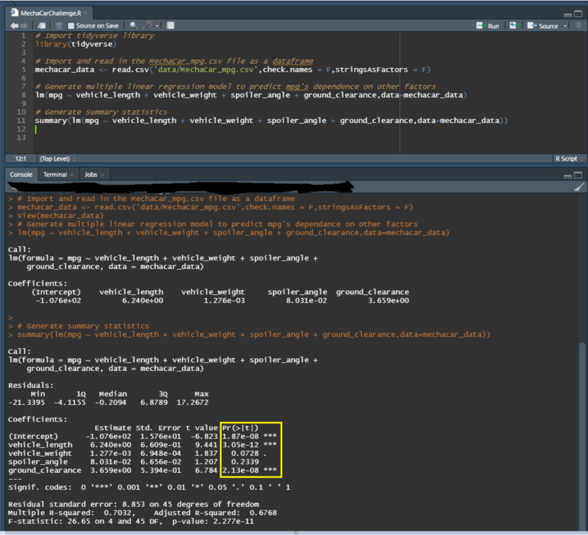
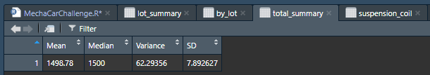
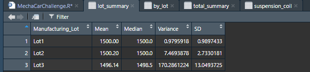
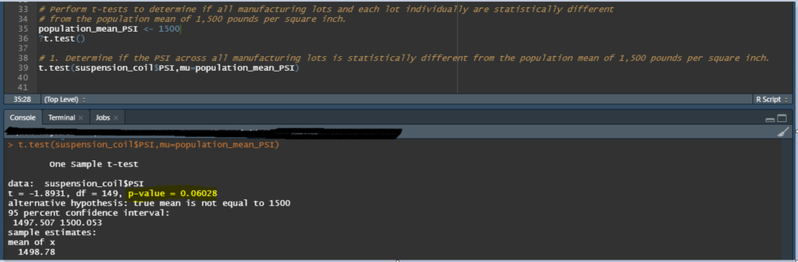
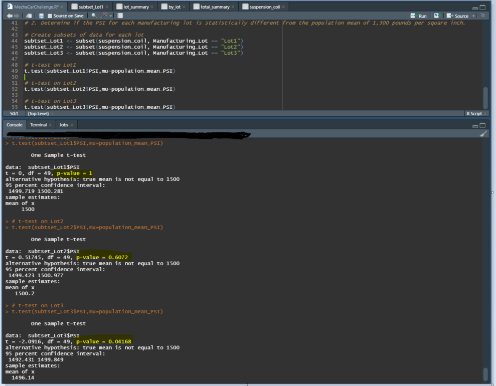

# DABC-MechaCar_Statistical_Analysis

## Linear Regression to Predict MPG

A Multiple Linear Regression has been performed to predict the MPG based on 5 factors: Vehicle Length, Vehicle Weight, Spoiler Angle, and Ground Clearance. Assuming a significance level of 0.05, the variables and coefficients that provided a non-random amount of variance to the MPG values are: Vehicle Length, Ground Clearance, and the intercept as their P-values are below 0.05. This would serve as our confirmation that the slope of these specifice variables are not considered to be zero as they have a statistically significant impact on the prediction of MPG.

This model may not be predicting the MPG of MechaCar prototypes effectively. While the r-squared value (coefficient of determination) is 0.70, which suggests that 70% of the variance in MPG can be explained by the model, the model is also missing some key variables due to the fact that the intercept is statistically significant. This implies that there are other factors contributing to the variation of MPG which are not included in this model.

</img>

## Summary Statistics on Suspension Coils
The design specifications for the MechaCar suspension coils dictate that the variance of the suspension coils must not exceed 100 pounds per square inch. As shown in below 2 summary tables,  the variance all manufacturing lots is 62.29356, whereas the variance for Lot 1, 2, and 3 are 0.9795918, 7.4693878, and 170.2861224, respectively. Therefore, the only set of data that did not meet the design specification is Lot 3 where its variance exceeded the maximum variance by 70 PSI. To gain statistical confirmation, a one-sample Chi-squared test can be performed on the variance to determine whether or not the variance of 170.2861224 is significantly greater than 100. This can be done with the varTest() function on R.

</img>

</img>

## T-Tests on Suspension Coils

A T-test has been performed on data from all lots and each individual lot, respectively, to determine if their means are statistically simlar to the population mean of 1,500. 

- Null Hypothesis: Sample mean is statistically similar to the population mean of 1,500.
- Alternative Hypothesis: Sample mean is statistically different from the population mean of 1,500.

Assuming a significance level of 0.05, the calculated P-value of 0.06028 for all lots is above the significance level. Therefore, we do not have sufficient evidence to reject the null hypothesis. The sample mean of 1,498.78 is statistically similar to the population mean of 1,500.
</img>

Assuming a significance level of 0.05, the calculated P-value for Lot 1, 2 and 3 are 1, 0.6072, and 0.04168, respectively. Therefore, the sample mean of Lot 1 (1,500.00) and Lot 2 (1,500.20) are statistically similar to the population mean of 1,500, whereas the sample mean of Lot 3 (1,496.14) is statistically different than the population mean of 1,500.

</img>

## Study Design: MechaCar vs Competition

To further compare the performance of MechaCar vehicles against the performance of vehicles produced by competitors, we could perform a statistical study to test the reliability of the vehicles. First, we will define "reliability" in terms of speed of acceleration and decceleration, measured in the number of seconds needed to accelerate from 0 to 100 kph and deccelerate from 100 to 0 kph. For example, drivers will need to be able to rely on the car's responsiveness to accerlerate and merge on the highway, and break as quickly as possible in dangerous situations. The quicker the response time, the more reliable the vehicle is.

### Below are the hypotheses with respect to the speed of acceleration
- Null Hypothesis: MechaCar vehicles' mean speed of acceleration in seconds is greater than or equal to the mean speed of acceleration of another competitor's vehicle of similar class/model. In other words, MechaCar vehicles do not accelerate faster than the competitor's vehicles.

- Alternative Hypothesis: MechaCar vehicles' mean speed of accleration in seconds is smaller than the mean speed of accleration of another competitor's vehicle of similar class/model. In other words, MechaCar vehicles accelerate faster than the competitor's vehicles.

### Below are the hypotheses with respect to the speed of decceleration
- Null Hypothesis: MechaCar vehicles' mean speed of decceleration in seconds is greater than or equal to the mean speed of acceleration of another competitor's vehicle of similar class/model. In other words, MechaCar vehicles do not deccelerate faster than the competitor's vehicles.

- Alternative Hypothesis: MechaCar vehicles' mean speed of decceleration in seconds is smaller than the mean speed of accleration of another competitor's vehicle of similar class/model. In other words, MechaCar vehicles deccelerate faster than the competitor's vehicles.

The statistical test that we will be using to test the above hypotheses will be the one-sided Two-Sample t-test since we are attempting to determine if there is a statistical difference between the distribution means from two samples: one from MechaCar vehicles, and another from a competitor's vehicles. In order to run the statistical test, we will need to randomly pick 30 vehicles produced from MechaCar manufacturing lots, rent 30 competitor vehicles (ideally in relatively new conditions) for a short period of time, and perform the acceleration / decceleration testing under the same controlled road conditions. Once we have the recorded data of the number of seconds needed for each vehicle to accelerate from 0 to 100 kph and deccelerate from 100 to 0 kph, we can perform the statistical test on R using the t.test() function.

